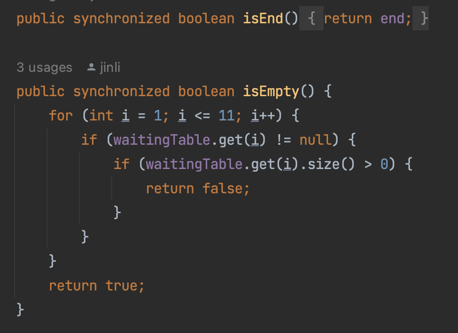
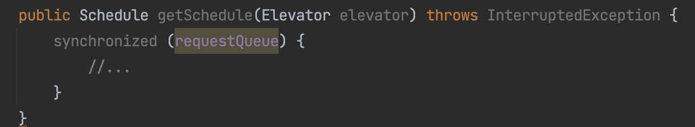
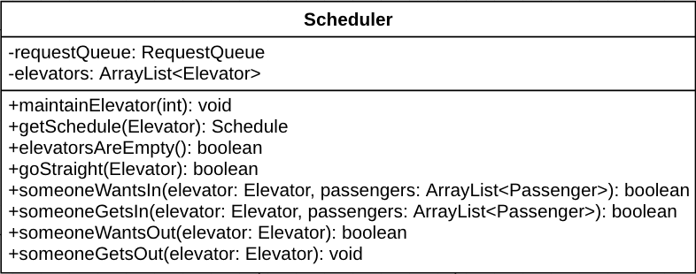
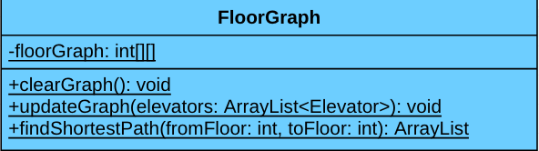
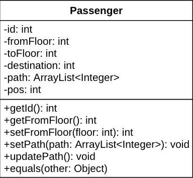
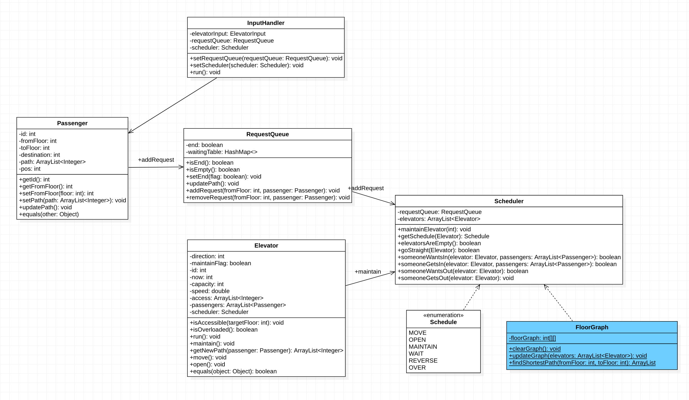
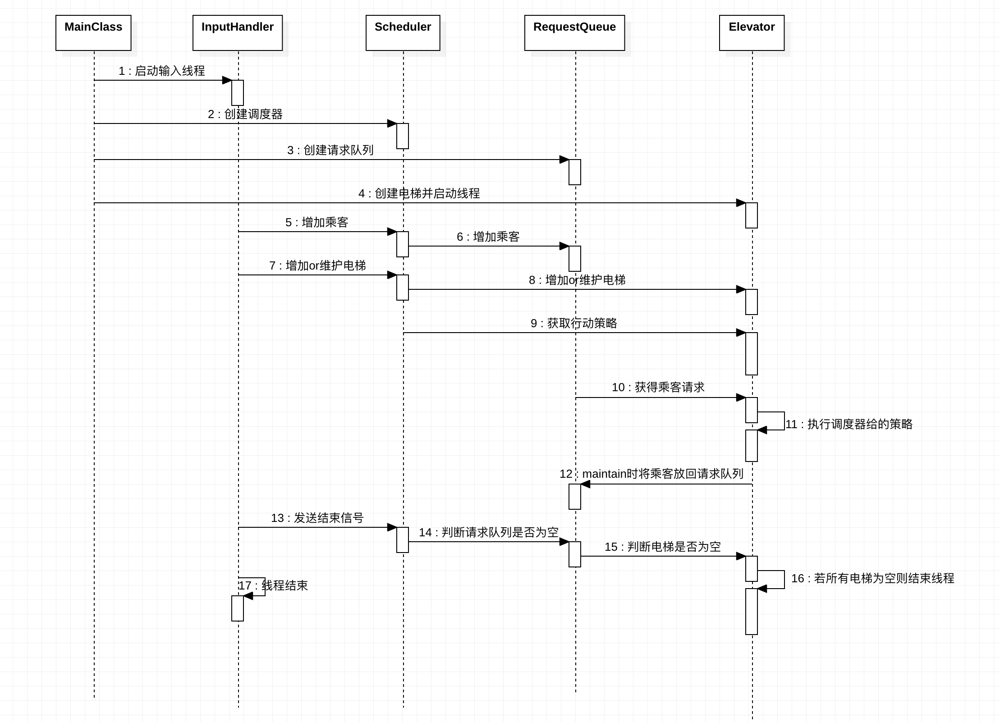
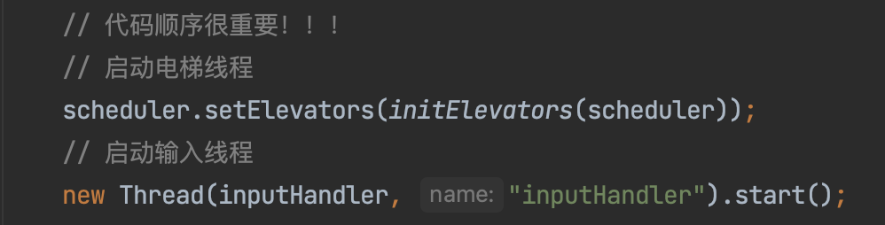
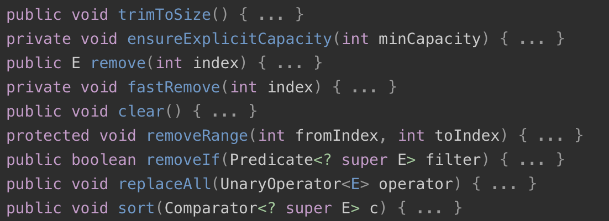

# BUAA-OO 第二单元总结
### 一、同步块的设置和锁的选择
同步块与锁是多线程的两大特产，也是我初学多线程时最迷茫与头疼的问题之一，经过三次作业的磨练，也只能说是初窥到一点门道，不敢说完全理解。
* #### 加什么锁？
    锁的分类总共有三类，这一点理论课上已经讲得很清楚了，这一部分我将结合我自己的代码讲解我在完成作业时都应用了哪些锁。
    1. **修饰实例方法**
        给实例化的对象加锁，格式如下：
        >public synchronized void method() {
        &emsp;// code
        }

        
        我在共享对象——也就是请求队列类里给每一个方法都加上了synchronized关键字，意思是对于共享对象的任何操作，不论是读还是写，都要上锁。而RequestQueue这个类在我的架构中只实例化了一个对象，也就是全局只有一个请求序列，如此便可保证对共享对象的读或写一定是互斥的。
    2. **修饰代码块** 
        给代码块加锁，表示进入该代码块之前要先取得该对象/类的锁，格式如下：
        > synchronized(this) {
        &emsp;// code
        }

        
        如上图所示，我在调度器Schedule类里和电梯Elevator类里都运用了修饰代码块的锁，一个是这两个类都涉及到频繁的对请求队列读或写的操作，所以进入该代码块之前务必先取得请求队列的锁；另一个原因是只能在同步代码块中调用wait或notify方法，例如在上图这个getSchedule方法中，如果判断该电梯下一步需要wait可以直接调用requestQueue.wait()方法。
    3. **修饰静态方法**
        给静态方法加锁，表示调用该方法时需要先取得整个类的锁，格式如下：
        >public synchronized void staic method() {
        &emsp;  // code
        }

        如前文所说，在我的架构中只有一个请求队列，也就是说共享对象只有一个对象，所以我并没有用到这类锁。
* #### 何时加锁？

* #### 如何避免死锁？
### 二、架构设计
#### 1. 调度器
本人调度器设计如下图所示：

&emsp;&emsp;在我的架构中，调度器不是一个线程，其包含的属性有请求队列requestQueue与电梯集合elevators。调度器是一个介于共享对象（requestQueue）与消费者（elevators）的媒介，起到了一个承上启下的作用。
&emsp;&emsp;调度器与电梯线程交互的方式是根据当前电梯的状态提供电梯下一步的运行策略，并负责根据requestQueue的状态wait或者notify某个电梯线程。
&emsp;&emsp;由于我采取的是自由竞争的策略，所以我的调度器的主要作用是给电梯提供下一步的运行策略，而不是负责调度具体的哪部电梯要去接哪个人，现在看来，我的调度器更像是所谓的“策略类”，而不是正经的调度器，所以也可以说我的架构没有“调度器”。这是我在初接触电梯问题时由于理解不够透彻而导致的历史遗留问题。
#### 2. 调度策略
* **Hw5，Hw6的调度策略**：在这一单元的作业中，我的调度策略一直是以类似自由竞争的策略为主，运行策略则采取Look算法。在这样的架构下，如果电梯检测到前方有符合Look策略的接人条件的乘客，就前往该楼层接上该乘客，如果有多个电梯同时到达该层，则采取二次咨询的策略，保证对于一个乘客只会有一个电梯为他开门。
    * **优点**： 
                （1） 代码量少，实现简单。
                （2） 因为对于一层楼的请求可能有好几部电梯同时赶过去，所以可以最大限度的保证乘客等待时间最少。
                （3）由于非人为指派，不会出现由于编程逻辑疏漏而导致的乘客无人接应的情况，正确性较高。
                （4） 抗压能力强。在与身边同学交流的过程中发现，若是对于一个请求每次指定一个最优电梯的算法，则在有很多个人同时从高层下到一层这种情况时，每次只有一步电梯上去接人，等它接完了别的电梯才会被唤醒；若是自由竞争则一开始所有电梯都会上去，效率高了不少。
    * **缺点**：
                （1）很有可能接到该乘客的电梯并不是最优解，易导致乘客在电梯里的时间过长，损失了性能。
                （2）耗电量大，多部电梯同时出动，这也是自由竞争最为人诟病的缺点。
                （3）可扩展性不佳，具体体现在当Hw7加入电梯可达性之后自由竞争策略就不太能满足要求，解决方案将在下文详细给出。
* **Hw7的调度策略**：Hw7加入了电梯可达性的要求，这就难免会出现乘客必须要换乘才能到达目的地的局面。显然自由竞争的方式难以满足请求，因为如果该电梯不能到达乘客的目的地，则不能接上该乘客。对于Hw7的换乘难题，我是试图将一个复杂问题拆分成若干个简单问题的集合，即对于一个乘客的路线，我将其拆分成若干段子路线，而对于每一段子路线，我都采取自由竞争的方式，让所有对于该段子路线起点与终点都可达的电梯自由竞争，也就是说我采取了一种**局部自由竞争**的策略，可以有效地解决之前出现的问题。在这种思路下，如何将乘客的路线拆分成若干子路线就成了一大难题。为了解决这个问题，我将Hw7的调度策略分为了以下步骤：
    * **构建图**：Hw7中，我运用了数据结构中所学到的图算法。对于两个楼层，可看作图的两个节点，遍历所有电梯，只要有电梯可达，那么这两个节点就有一条边相连，如此构建邻接矩阵。值得一提的是，该图需要时常更新，例如每次maintain后由于电梯发生了变化，都需要重新构建一遍邻接矩阵。
    * **BFS**：构建好图以后，换乘就转化为了最短路径问题。我选用的是广度搜索算法（BFS），将搜索到的最短路径的节点存入一个ArrayList中，并将其作为乘客的一个属性。然而我这种架构存在一定问题，我构建的是无权图，实际上每次选取的是换乘最少的路线，众所周知的是，换乘最少 ≠ 时间最短，而且我这种算法如果遇到只剩下一部全楼层可达电梯的话就会“累死”这部电梯。解决方法是构建有权图，但边的权值如何界定又是一个问题，实在是很难构建一个“完美”的权值以表示两个楼层的关系，由于本人能力有限，便止步于无权图为止了。为此我新建了一个**floorGraph**类，如下图所示。

    * **封装乘客的起点与终点**：前文提到，乘客的一个属性是由楼层图搜索出来的最短路径的集合，在乘客面对电梯时，只暴露自己当前的fromFloor与toFloor，对于电梯来说该乘客只是从当前fromFloor到toFloor的一段请求，在乘客下电梯时更新自己的fromFloor与toFloor，如果当前所处楼层等于乘客的目的地则不管他，否则将其再加入请求序列中，等待下一段子路径的电梯去接他。对于电梯来说，乘客只是一段请求，仅需考虑这段请求的出发地与终点即可，无需考虑乘客的其他路径，如此便可实现一个简单的换乘策略。乘客的属性与方法如下图所示。

* **总结分析**：经过三次作业的强测成绩与自己的编程感受，我认为我的调度策略还是非常不错的。这三次作业下来没有对调度策略有太大的改动，只是第7次作业有所拓展而已，其在性能方面的优缺点已在前文有所分析。毋庸置疑的是，没有一种调度策略是完美的，某种调度策略在某一种情况下可能远优于其他策略，但在其他情况下又可能表现出劣势；而对于多项性能指标来说，就更难同时兼顾所有指标，就拿自由竞争来说，它在乘客等待时间这项指标上表现不错，而在耗电量上就表现出一定的劣势。然而自由竞争已经算是一个较为中庸的策略了，在多项性能指标上表现没有特别突出的，但也没有特别差劲的，而且不需要根据题目情景的变化而改变调度算法，因为本就没有算法，这更像是一种以不变应万变的法则，而且从几次强测成绩来看，自由竞争的性能也相当不错。

#### 3. UML类图
本单元作业的UML图如下图所示：

其中蓝色部分为Hw7所添加的类，Hw5-Hw6的过程没有再添加类。

#### 4. UML协作图
本单元作业的协作图（sequence diagram）如下图所示：

#### 5. 架构总结
&emsp;&emsp;通过本单元的三次作业，我认为我的架构总体上设计还算良好。具体体现在我这三次作业的迭代是线性的，每一次作业都是在前一次作业上修改而成，没有重新设计架构，体现了良好的可迭代性。
&emsp;&emsp;这三次作业中，架构中较为稳定的部分是线程之间的协作关系，我自始至终都采取了只有输入和电梯是线程的方法，整体上的执行请求的方法没变。易变的部分是调度器中的getSchedule方法，需要根据题目场景的变化而不断更新电梯运行的策略，比如Hw6增加了Maintain策略，Hw7要判断电梯能不能开门等等；同理，电梯内部的运行方法也较为易变，因为要为调度器带来的策略改变而添加方法。总的来说我认为我的架构设计还是不错的，自始至终也没有重新设计调度策略，而运行方面的细节变化毕竟是在所难免的。

### 三、Bug分析
#### 1. 公测Bug
&emsp;&emsp;本次作业的三次强测及互测中我只在Hw6的强测中出现了bug，而这个bug在当时的我看来是非常不可思议的，因为我在本地无法复现，并且我在bug修复时试着预览了未修改的版本，也是可以全部通过的（最后提交的版本并非未修改的版本），所以我一度非常迷茫，甚至怀疑是不是评测机的问题。直到Hw7，我用了讨论区同学分享的多线程评测机，同时用很多个线程测同一组数据，终于找到了问题。
&emsp;&emsp;该bug是由于我在主线程的代码顺序导致，正确的逻辑是应该初始化六部电梯并启动线程，再启动输入线程，如下图所示：

&emsp;&emsp;如果不是这样，在增加电梯的请求来临时，很有可能会导致这部新电梯加入不到电梯集合中，因为有可能此时电梯集合还没有被创建。这个问题只有在很多个测试线程同时进行时才有可能出现，本地测试出现的概率极低，这就是多线程的一大特点，经过这次bug修复我体会的非常深刻。

#### 2. 本地Bug
* **CurrentModificationException**
这个异常是我在初次接触多线程时折磨我最久的一个bug，也是多线程中比较经典的一个bug，在研讨课上与同学交流时发现有不少同学都遇到了该异常。
    * **原因**：在ArrayList抽象类中定义了一个modCount属性，且声明为protected transient，表示对集合的修改次数，在如下方法中都会使modCount++。
    
    而java中要检查ArrayList的expectedModCount与modCount是否相等，如果不相等则会报CurrentModificationException错误。而expectedModCount值记录的是调用iterator方法时的modCount值，但调用过一次remove之后，modCount自增1，也就与expectedModCount不相等了。在多线程里，我们难免会避免多个线程对同一个对象进行增加、删除等修改，也就难免会导致异常产生。
    * **Fail-Fast**：但有一个问题就是，我们对所有共享对象的修改操作都是加了锁的，理应不存在多个线程并发修改共享对象的问题，为什么还会报出异常呢？个人认为是由于java的fail-fast的机制，使得即使并未出现线程并发修改的问题，但java认为可能有这个风险，就会报出异常。
    * **修改方法**：
        （1）：避免使用remove方法，采用迭代器Iterator的方法进行遍历删除。这个方法身边的同学有证明可行的，但可惜在我的程序里并不奏效
        （2）：采用fori循环而不是for循环进行遍历，该方法要特别注意执行i--。
        （3）：将删除操作改为遍历集合，并创建一个新的空集合，如果该元素与要删除的元素不相等则加入新的集合。后来我才了解到这实际上就是CopyOnWriteArrayList的实现机制，所以不妨直接使用该容器。
        （4）：使用线程安全的容器，如ConcurrentArrayList。
* **结束条件**：在这一单元的作业中，结束条件是一个需要谨慎斟酌的问题，若有偏差则有可能导致提前结束或者无法结束的问题。经过这三次作业，我最终的结束条件如下：
    * 请求队列为空
    * 所有输入结束
    * 所有电梯都没有乘客  
其中第三条是针对maintain请求新加入的。
* **DeBug方法**：多线程中我的debug方法主要采用打印流派，即打印某一函数当前的一些参数或者某一线程的一些属性。这种方法在大多数情况下都非常有效，但有时会出现加了打印语句与不加打印语句输出不同的现象。我简单查阅了一下，这个现象应该是由于打印语句是一个较为费时的操作，在执行打印语句时可能会先把cpu的控制权让给别的线程，导致输出不一致的现象发生。
&emsp;&emsp;其次是用多线程评测机debug。正如上文所说，有些bug只有在多线程同时评测的时候才可以复现，所以若想要稳定复现，就不能仅依靠本地测试或者单线程评测机。

### 四、心得体会
#### 1. 线程安全
&emsp;&emsp;在这一单元的作业中，线程安全是一个很值得注意的问题，正如Bug分析中所指出的CurrentModificationException就是一个很经典的线程安全问题，这也提醒了我线程安全不只是加不加锁的问题，对共享对象的删改操作也是相当值得注意的。此外，在多线程编程时不能为了图方便就一味的将所有方法都加上锁，例如多线程对于一个对象只有读-读冲突时就不需要上锁，上锁过多会牺牲性能。最后我想表示一下遗憾，在第二、三次理论课上老师为我们介绍了线程安全的容器、读写锁与信号量的使用，但是我在后两次作业中并未应用，虽然也可以顺利通过评测，但终究是少了几分“优雅”，也少了一些收获知识的快乐。
#### 2. 层次化设计
&emsp;&emsp;这一单元作业依然需要事先进行慎重的层次化设计，课程组在本单元第一次理论课的PPT最后留下了几个问题，我认为对设计是很有帮助的，我在敲代码之前谨慎思考了这几个问题，并根据生产者-消费者模型构建架构，果然起到了事半功倍的效果，我的架构顺利沿用了三次，并为重构。再次警醒敲代码之前务必要谨慎的构思，不仅有利于降低整个工程的复杂度，还有利于后期的迭代。