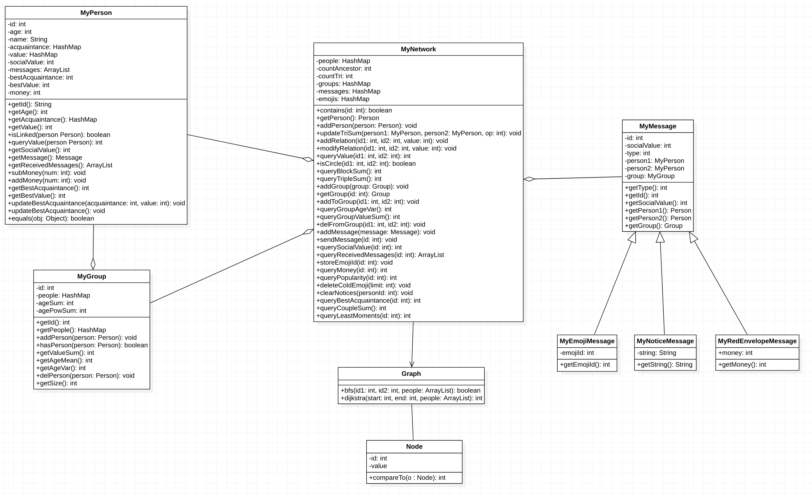
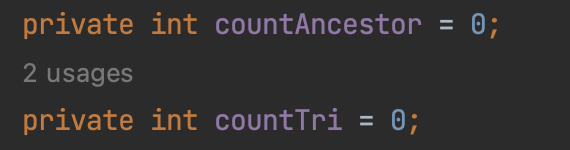
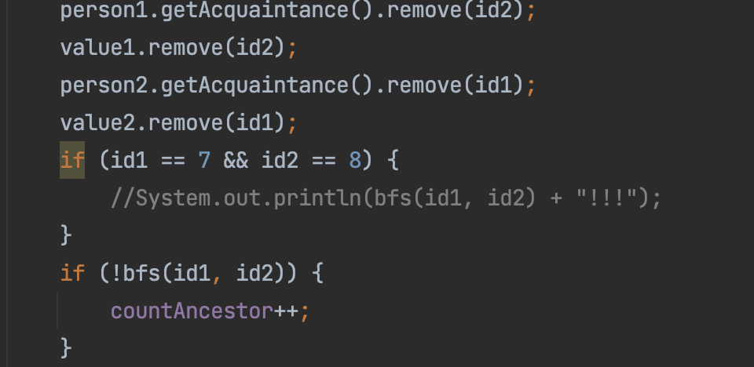

# BUAA-OO 第三单元总结
### 一、测试过程
#### *Q1：谈谈你对黑箱测试、白箱测试的理解*
* **黑箱测试**：指把程序看作一个不能打开的黑盒子，在完全不考虑程序内部结构和内部特性的情况下，在程序接口进行测试，它只检查程序功能是否按照需求规格说明书的规定正常使用，程序是否能适当地接收输入数据而产生正确的输出信息。一般我们说的用评测机进行测试就是黑盒测试。
* **白箱测试**：这里的盒子依然指的是被测试的软件，白盒指的是盒子是可视的，即清楚盒子内部的东西以及里面是如何运作的，也就是全面了解程序内部逻辑结构、对所有逻辑路径进行测试。在使用这一方案时，测试者必须检查程序的内部结构，从检查程序的逻辑着手，得出测试数据，也就是说我们阅读代码找bug的行为就属于白盒测试。
* **我的理解**：在我的作业过程中，我基本上采用的都是黑盒测试，也就是用数据生成器 + 对拍器的方法进行测试。但是在OKTest这一部分我采用的是白盒测试，因为OKTest很难自动生成数据，所以我针对每一条ensures都构造了一种情况，以此检测能否满足要求。个人认为好的测试过程应该是黑盒配合白盒测试，虽说评测机很好用，但是不能完全依赖评测机，因为依靠随机生成数据的方式很容易有某种特殊的情形被忽略，在Bug分析中我将详细举例。而且在互测中，如果是a级房，说明大家的代码都比较完备了，通过评测机很难跑出问题，往往这个时候阅读对方代码找漏洞的方法更加有效。所以在测试过程中建议采用白盒、黑盒并行的测试方法。
#### *Q2：对单元测试、功能测试、集成测试、压力测试、回归测试的理解*
* **单元测试**：是指对软件中的最小可测试单元进行检查和验证。对于单元测试中单元的含义，一般来说，要根据实际情况去判定其具体含义，如C语言中单元指一个函数，Java里单元指一个类。总的来说，单元就是人为规定的最小的被测功能模块。单元测试是在软件开发过程中要进行的最低级别的测试活动，软件的独立单元将在与程序的其他部分相隔离的情况下进行测试。
* **功能测试**：功能测试也称黑盒测试，前文已有描述，此处不再赘述。
* **集成测试**：在单元测试的基础上，将所有模块按照设计要求（如根据结构图）组装成为子系统或系统，进行集成测试。 
* **压力测试**：是给软件不断加压，强制其在极限的情况下运行，观察它可以运行到何种程度，从而发现性能缺陷，通过测试程序在同一时间内或某一段时间内，向系统发送预期数量的交易请求、测试系统在不同压力情况下的效率状况，以及系统可以承受的压力情况。然后做针对性的测试与分析，找到影响系统性能的瓶颈，评估系统在实际使用环境下的效率情况。比如在强测数据中构建一个非常庞大的图然后疯狂测试qlm指令或者qbs、qcs指令的行为。
* **回归测试**：是指修改了旧代码后，重新进行测试以确认修改没有引入新的错误或导致其他代码产生错误。在OO的Bug修复阶段采用的就是回归测试的策略。
#### *Q3：是否使用了测试工具*
* 我用了评测机（数据生成机 + 对拍器）的方式进行测试。
#### *Q4：数据构造有何策略*
* 我在OKTest的测试中构造了数据，主要是根据每一条ensures进行枚举构造。
### 二、架构设计
#### 1、UML图

#### 2、图模型及算法
虽然助教说过本单元对算法要求不高，~~但显然是不能相信的~~，事实证明本单元作业需要我们较为熟练的运用图算法，甚至在有需要的情况下对图算法进行改进。我在本次作业中的图算法部分也是历经波折，经过了多次删改才确定的如下算法。在上面的UML图中也可以看到，我专门设立了一个Graph类，这是一个工具类，里面提供图的主要算法。
* **bfs**
    本单元作业的qci指令就是要查看两个点的联通性，我选用的是bfs方法判断联通性。在Hw9的时候我本来采用的是并查集的算法，但是可惜Hw10中出现了modifyRelation方法，这种方法需要删除二者关系，也就是图要进行删边的操作，于是只能放弃并查集改回bfs。
* **dijkstra**
    本单元作业中的qlm指令实际上就是求过某个点的最小环。我的基本思路是，若对于点x求最小环，则遍历它的所有相邻节点，先删去二者的边，再求出x到该节点的最短路径的权值之和，得到的权值之和再加上二者之间边的权值，就是这个环的权值。遍历所有相邻节点之后得到的最小值就是要求的答案。求最短路径的方法我用的是dijkstra，并采用优先队列进行优化。
    但最终这个方法还是ctle了，本来是想照着课程组提到的每次作业优化方法的文章学习一下如何动态维护，但发现课程组也并没有给出优于我的算法，大概能说明qlm无法通过动态维护来解决。于是我照着讨论区同学的算法写了魔改版的dijkstra，只能说学到了很多。
* **动态维护**
    在本单元作业中，算法上的差距要远远小于动态维护与静态查询之间的差距，真正导致tle的往往不是算法落后，而是没有动态维护。在第一次作业之后我深深领悟了这一点，于是我为了qbs和qcs指令新建了两个属性，如下图所示：
    
    这两个属性的意思分别为求祖先的数量，也就是求非联通子图的数量；另一个是求三角关系的数量。在每次我们添加、删除关系后都要及时对这两个变量进行维护，这样一来不管是并查集还是bfs，效率都大幅度上升。
#### 3、Bug分析
* **性能问题**：我在Hw9和Hw11的强测中都出现了ctle的现象，其中Hw9是因为，没有采取动态维护的思想。我本来以为是由于bfs的效率不如并查集，于是我在Hw9的bug修复阶段大费周章地改了并查集，到Hw10发现处理不了删边问题又大费周章地改回bfs，做了许多无用功，原因就在于我没有领悟到以下道理：**动态维护的重要性远远大于优化算法！** 这也是本单元交给我的最深刻的道理。  
    Hw11中我没有扛住qlm的压力测试，这一部分至少目前个人认为是无法动态优化的，课程组给的优化方法也没有提及，所以只能归功于算法问题，修复时我参考了讨论区的魔改版dijkstra，此处不再赘述。
* **非性能问题**
    我在Hw10中遇到了两个非性能问题。
    * 其中一个是由于我忽略了jml中对于Group的人数有限制，最多1111人，而我在读jml时忽视了这一点。
    * 另一点是由于我在本地改bug时加的打印语句忘了删除，如下图所示，只在特定情况才能输出，然而这样就被互测的房友精准打击了。
    
    * **总结**：这两个非性能问题再次警醒我们，不是所有的bug都能被评测机找出来的，如果评测机没有恰好向一个组中加入1111人，我这个bug就无法发现，并且第二个bug既然被刀了出来，我相信那位房友很可能也是看了我的代码后精准打击。所以千万不能盲目依赖评测机，要重视白盒测试，检查代码的逻辑正确性与完备性。
#### 4、OKTest
* OkTest可以检验代码是否符合规格，并细化到每一条jml语句中，探究究竟是哪条jml语句没有满足，可以缩短debug的范围，并且还能检测是否正确抛出异常，是一种非常好的检测代码是否符合规格的方式。
#### 5、学习体会
&emsp;&emsp;本单元以社交网络模型的形式，带我们学习了规格化设计，了解了JML的基础语法，由此领略到了严谨、规范的契约式编程的魅力。在规格化设计的过程中，我感悟最深的是规格与设计分离的思想，在我看来，规格只是告诉了你这个方法实现完了是什么效果，但并不是实现的方法，有很多方法如果按照规格里的for循环去写就只能tle了。所以我觉得这个单元正确的写作业步骤是先读规格，明白这个方法想要干什么，再在理解的基础上自己设计思路去实现。
&emsp;&emsp;通过这一单元我还领会了算法的魅力。之前在数据结构中，图这一块我学的不是很认真，这一单元的作业可以说是很好的帮我补充了这一空缺。在这一单元中，我接触到了无权图求两点间联通性、有权图求最小环等问题，并分别对应的应用并查集/广度优先搜索、dijkstra算法去实现。并且本单元作业还不满足于仅仅是应用这些经典的算法，还要求进行优化，让我进一步的体会到了算法的魅力，感谢OO课程组，也感谢讨论区的各位大佬对我的帮助。
