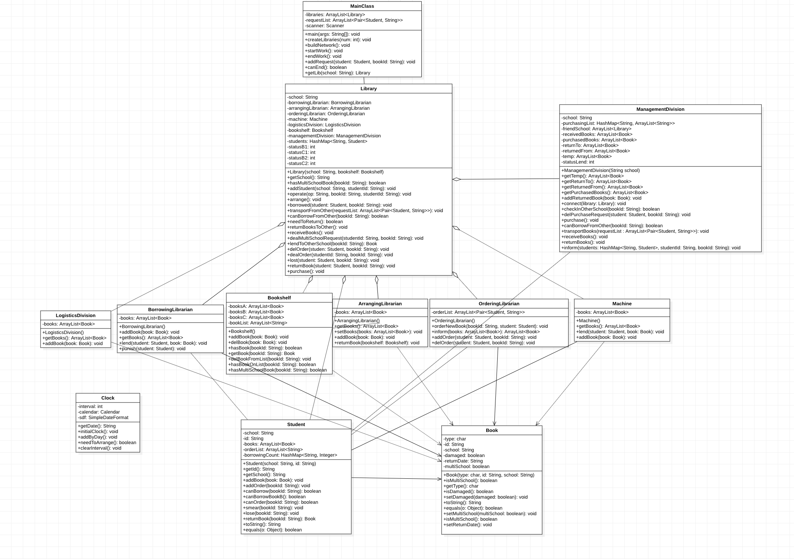

# BUAA-OO 第四单元总结
## 一、本单元所实践的正向建模与开发
正向建模是一种基于面向对象的软件开发形式。正向建模的流程是先明确场景需求，从需求出发建立模型，构建类图、状态图、时序图，最后实现代码。逆向建模与之相反，是将模型套用至场景的过程。
本单元作业中我采取的是正向建模的过程，每一次作业我都是先根据指导书总结图书馆的工作流程，在纸上绘制一些草图，然后按照草图搭建模型。例如第一次作业，是一个平地起高楼的过程，也是最考验建模能力的过程。面对庞大复杂的信息，我现将图书馆的工作分为三个大类，分别为借书、还书、丢书。其中借书又可以分为图书馆是否有余本，有余本的情况再分为A、B、C三种书籍类型的情况；还书分为根据所还书籍种类分为两种情况。如此先进行一些简单的梳理之后，便能理清各部门之间的业务逻辑，接下来只需要根据指导书中所提到的部门分别建类、实现功能即可。
## 二、本单元作业的架构设计
本单元的uml类图如下所示。

除了对图书馆的每个部门都建立了类以外，我还设计了一些其他类。除了对书、学生分别建类以外，我还建立了一个图书馆类。通过类图也能看出，Library类使得图书馆里的各部门之间没有关联关系，完全依靠Library类与别的部门进行交互，对每个学校内部而言实现了单例模式。个人认为我在本单元的架构体现了一定的高内聚、低耦合思想，并且也符合正常图书馆的工作流程，缺点可能是这样就会使得Library类复杂程度过高。
此外我还构建了一个Clock类，专门负责处理日期的增加，并且有一个静态方法负责获取当前的时间。相当于为整个系统加了一个系统时间。值得一提的是通过这次作业我也学习到了一些java关于日期的知识，例如calendar类的使用等等。
本单元作业依然没有经过重构，也体现了架构设计的一些可取之处。
## 三、四个单元中架构设计思维的演进
* 第一单元的主题是表达式解析，我采取的是大多数人都同样采用的Poly架构，即将所有表达式都统一成若干多项式的和。这种架构其实是分为两个体系，一种是表达式-项-因子，另一种是多项式-单项式，前者是递归下降解析的结果，后者是进行计算的工具，二者之间通过因子的toPoly方法实现转化。或许是由于上学期cpp课铺垫了一定基础，我在第一次作业中便采用了一个面向对象的架构去实现，当然也是由于我提前阅读了一些往届学长的博客，在整个第一单元中我没有经历过重构。
* 第二单元主题是多线程，要求实现一个电梯调度系统。在这一单元中，我采取的架构策略是一种将调度器与自由竞争结合的方式，调度器与电梯线程交互的方式是根据当前电梯的状态提供电梯下一步的运行策略，并负责根据requestQueue的状态wait或者notify某个电梯线程。在这里调度器是一个介于共享对象（requestQueue）与消费者（elevators）的媒介，实质上起到了一个承上启下的作用。总而言之，就是电梯只负责运行，乘客只负责等待，中间的交互依靠调度器给的策略，分工也是较为明确，并且体现了高内聚低耦合的思想。这一单元同样也没有进行重构，并且这一单元也是我和小伙伴在架构上争论较多的一个单元，我们意见非常不统一，最后谁也没办法说服谁。
* 第三单元的架构设计不需要我们来完成，只需要根据jml补全代码即可。但在这一单元，我深刻的体会到了设计与实现分离的思想，第一次作业我老老实实地按照jml实现代码，结果就在强测被小小的震撼到了。所以jml只是告诉开发者代码应该是什么效果，并不是开发的方式。此外，我对于课程组的架构设计还有一点小小的建议，个人认为MyNetwork这个类太过庞杂，所有的社交方法都在这个类里，然而我们根据需求的不同显然是可以再拆分出来一些类的，我们在实现的时候也常常为了超过500行而苦恼。
* 第四单元的架构设计已经在前文所述。
**总结**：纵观这四个单元，我的架构设计能力也是逐渐在提升的。我自认为我的设计习惯还算不错，基本上每周二，OO作业发布的当天，我是不敲代码的，只是进行一些设计方面的思考，从周三开始实践，这显然也是降低了我的架构重构风险。我在四个单元的作业中均没有经历过重构，也是得益于这种较为良好的设计习惯。当然也不得不承认，我在前两个单元也借鉴了一些往届学长的架构，但在第四单元，由于这是我们这届的全新项目，我没有学长可参考，不过有了前两单元的设计经验，我也没有遇到太大困难。此外，前两单元的作业我还不太懂什么是设计模式，在第四单元我已经有意识的运用单例模式解决问题。这些都体现出了我的架构设计能力是不断进步的。
## 四、四个单元中测试思维的演进
* **第一单元**：尚未明白测试的重要性，最开始由于课程组给了第一次作业的评测机，所以第一次作业没什么问题。但第二次作业开始就没有可以白嫖的评测机了，我也没有特别的重视，导致第二次作业甚至没有进互测。第三次作业开始我就决定自己在已有的评测机上添加功能，又取得了不错的成绩。
* **第二单元**：这一单元的作业让我明白了评测机之间亦有差距。这一单元主打一个多线程，更主打一个玄学，有时会遇到单线程评测机跑一千次才能跑出来的玄学bug。我在第二次作业中，本来已经用单线程评测机测试的差不多了，结果强测又被震撼到了。到了第三次作业讨论区大佬分享了多线程评测机，几十个线程一起跑，就能跑出bug了。这次作业带给我的教训是评测机也需要对症下药。
* **第三单元**：这一单元的测试主要采用数据生成+对拍的方式。见识到了第一次作业以后，我们发现本单元其实是披着jml外壳的算法题，于是我和小伙伴对拍时每次都把测试强度拉满，指令数量以万为单位，来观察是否会有超时的现象。此外，从我们这届还引入了OKTest，这一功能很难数据生成，于是我采用了手搓数据的方式。这一单元让我体会到了黑盒与白盒并行测试的好处。
* **第四单元**：这一单元由于我自己都不好理解指导书的要求，更别提写一个评测机了，并且数据的限制非常多，对于评测机的编写要求也非常大，甚至连讨论区都没有人分享评测机。但是我这单元的后两次作业依旧取得了满分的成绩，主要就是因为我自己手搓了很多数据，模拟了很多种借书的情况，这一单元完完全全是靠白盒测试度过的。
**总结**：四个单元下来，我从不是很重视课下测试、过了中测就是胜利的心态到对评测机求贤若渴、测试强度拉满，对测试越来越看重。此外，我对测试的认知也从完全依赖评测机，演进为认识到白盒测试也是很重要的，手搓测试数据的比重也是不断在增大的。这些都体现出了我的测试思维的演进
## 五、课程收获
&emsp;&emsp;我对OO的感情无疑是复杂的。首先它绝对是我这学期耗时最多的课程，没有之一。这学期仅有的几次为了改bug熬夜到凌晨一两点，都奉献给了OO；并且每周一次作业，周日就截止提交，在此之前你要做好开发、测试、代码风格检查等一系列工作，相当于如果你进展不顺利的话，你就丧失了享受周末的权利。然而改bug这种事情谁又能说的好呢，所有写代码的人应该都能明白，改bug是一个时间的无底洞，说不好要耗费多少时间。还有别出心裁的互测制度，让我在开启互测的那一两天里时时刻刻提心吊胆，时不时就要刷新一下互测界面，看看自己有没有被刀中。可以说，我这学期所有的崩溃、沮丧、怀疑人生，大多都和OO有关。
&emsp;&emsp;但是真情实感且非阴阳怪气地讲，OO确实是磨练人的。我在代码方面的进步甚至可以用“蜕变”来形容。从大一的时候畏惧敲代码、敲不出来代码，敲几十行代码就已经是上限了，到前两天OO的第四单元作业，我从架构开始，到初步写完一个六七百行的程序只用了两天时间，这种进步无疑是质的飞跃。并且从OO的学习中我确实也能学到很多关于架构设计的一些思想，这是一个从能写“对的程序”到能写一个“优雅的程序”的阶段，也培养了良好的设计习惯，先构思再敲代码，这些思想与习惯是受益终生的。
&emsp;&emsp;不知道是不是OO培养了我的受虐倾向，我现在还蛮享受这种改bug的感觉的。打开评测机、报错、定位错误范围、改bug、再打开评测机，这种一次又一次的轮回作为铺垫，显得最后那十几个绿勾更加耀眼。
&emsp;&emsp;最后也祝愿北航的面向对象课程可以越办越好，~~早日比肩mit~~。